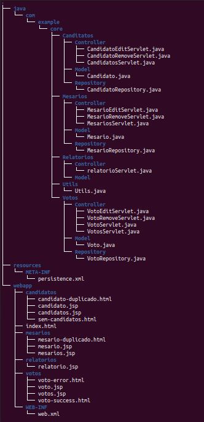
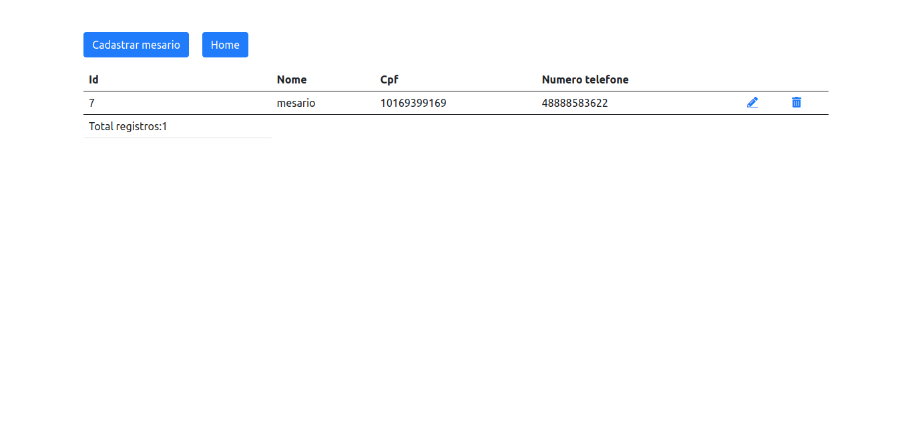
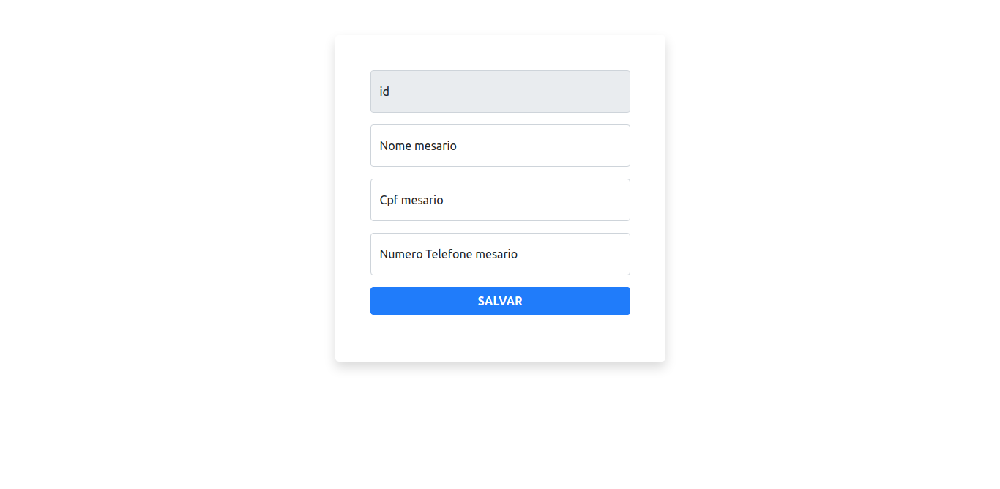
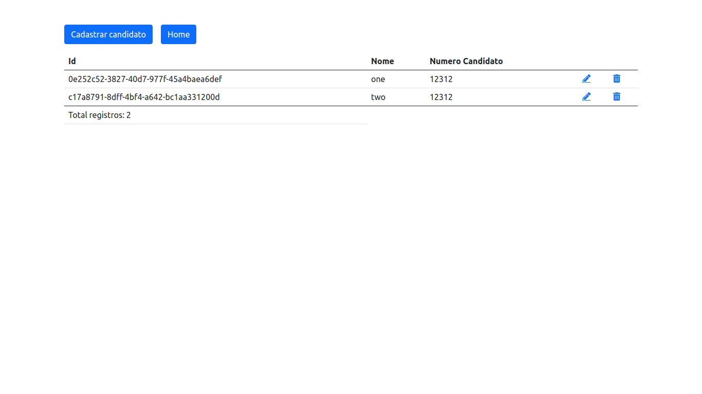
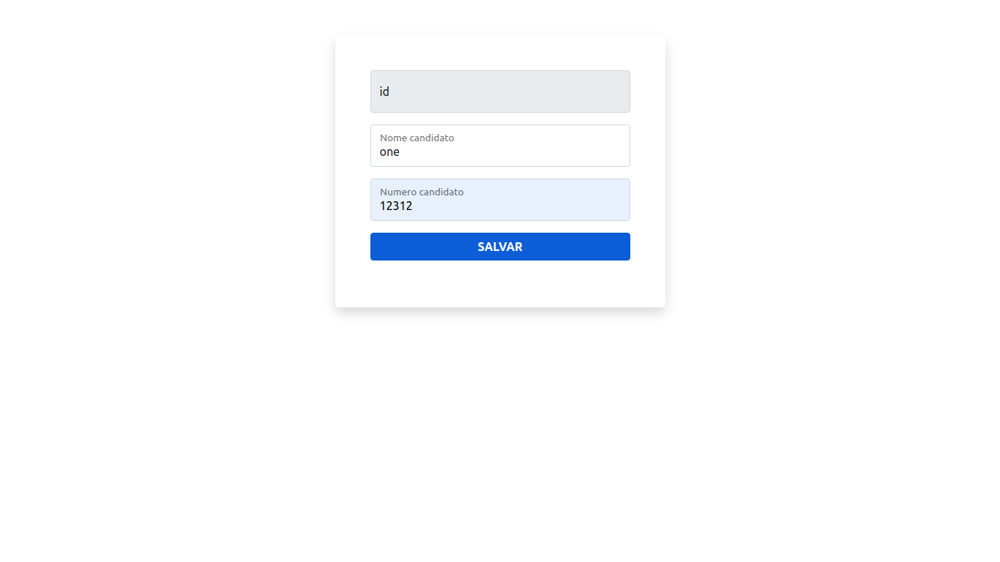
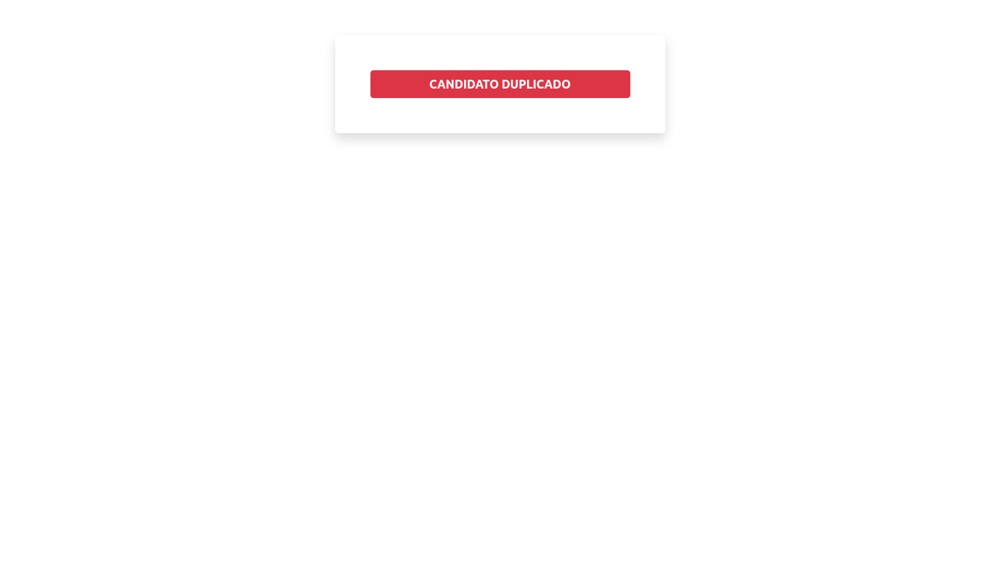
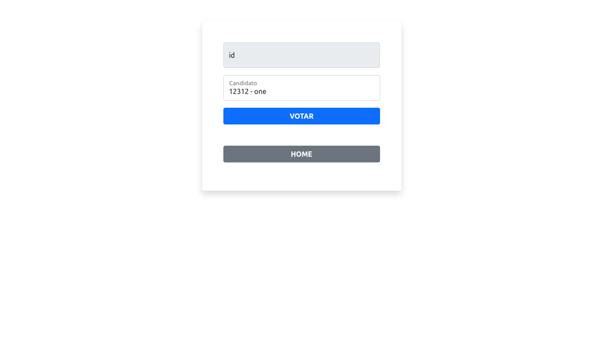
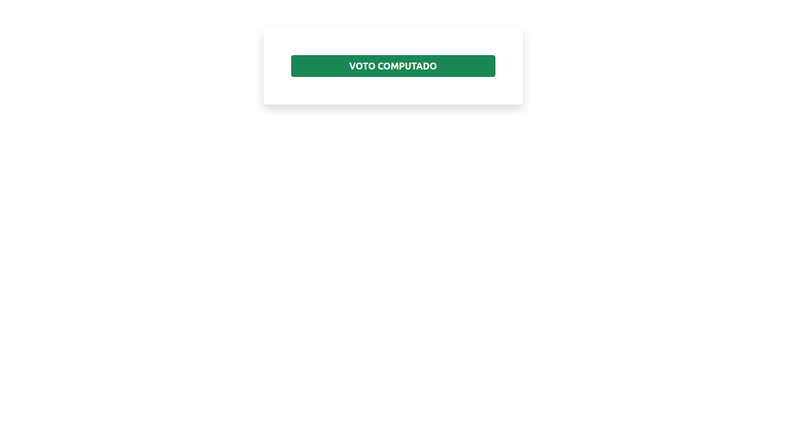
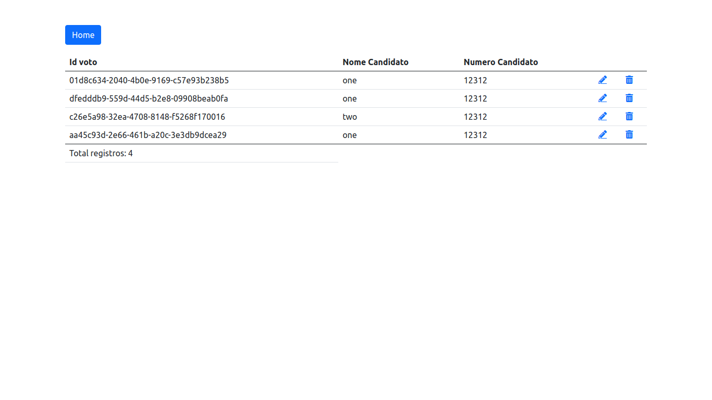
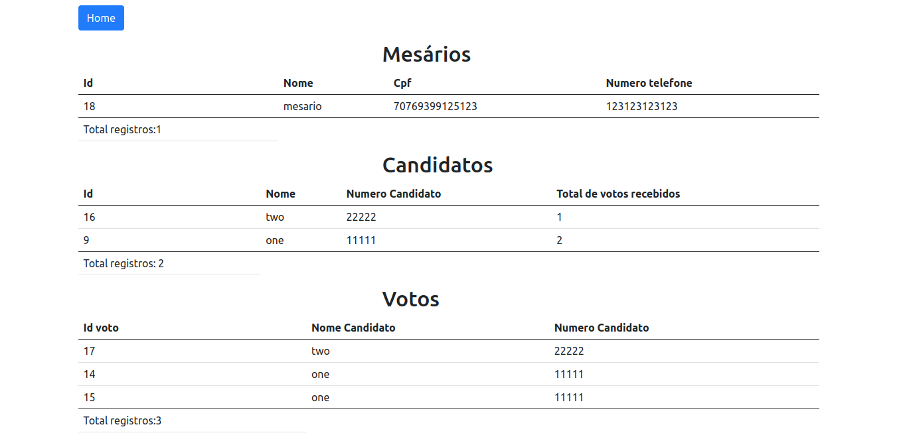

# Servlet Basic
    Trabalho desenvolvido para a disciplina de Tópicos Especias II

## Requisitos de aceitação 

- [X] Ao menos 3 cadastros completos (Listagem/Relatório, Cadastro, Edição, Remoção);
- [X] Deve-se utilizar banco de dados para a persistência dos dados, a escolha de qual banco, fica com a equipe, lembrando apenas que a mesma deve conhecer o banco utilizado, para responder eventuais questionamentos.
- [X] utilizar o padrão MVC

## Árvore do projeto

## Telas do projeto 

<h2>Home</h2>

<h2>Mesários</h2>

<h2>Candidatos</h2>

<h2>Votar</h2>

<h2>Lista de votos</h2>

<h2>Relatório</h2>

