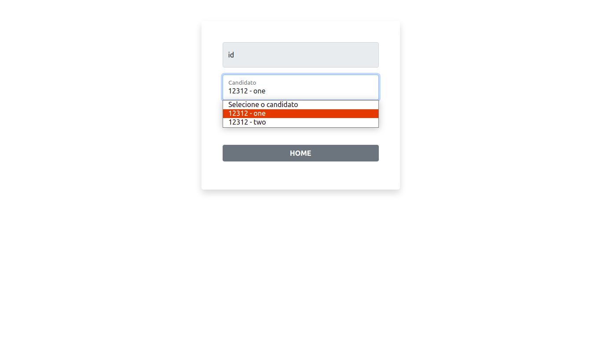

# Servlet Basic
    Trabalho desenvolvido para a disciplina de Tópicos Especias II

## Requisitos de aceitação 

- [X] Ao menos duas classes de modelo (com seus cadastros, páginas para editar e
   remover);
- [X] Controller´s para manipular as requisições e armazenar os objetos na sessão
   ou cookie a escolha sobre qual utilizar, fica a cargo do aluno/equipe;
- [X] Um servlet que exiba (em HTML) todos os objetos armazenados em memória
   (relatório);
- [X] O site/sistema deve permitir o cadastro e listagem de múltiplos elementos (do
   item 1) em memória (utilizando sessão ou cookies);
- [X] Os objetos devem possuir páginas separadas de cadastro;
- [X] Uma página (servlet) que exiba a quantidade de cada um dos itens
 armazenados na memória (pode ser a mesma página do requisito 3).
- [X] Não devem ser utilizadas TAG´s JSP, arquivos
  JSP devem ser utilizados como HTML)

## Árvore do projeto

## Telas do projeto 

<h2>Home</h2>

<h2>Mesários</h2>

<h2>Candidatos</h2>

<h2>Votar</h2>

<h2>Lista de votos</h2>

<h2>Relatório</h2>

